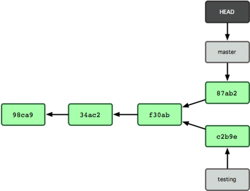

### 初识分支

Git 保存的不是文件差异或者变化量，而只是一系列文件快照。
在 Git 中提交时，会保存一个**提交（commit）对象**，该对象包含一个指向
暂存内容快照的指针，包含本次提交的作者等相关附属信息，包含零个或
多个指向该提交对象的父对象指针：首次提交是没有直接祖先的，普通提
交有一个祖先，由两个或多个分支合并产生的提交则有多个祖先。

**提交对象**里面具体文件的快照，包括blob、tree等对象，这些都是
git用来保存快照的底层数据结构。同时由于每次commit都会产生一个SHA-1值，
那么我们也就**可以用SHA-1值来代表具体的某个Commit **，一个commit大致如图：


当我们进行多次提交后，git仓库历史如图：


看到上图我们对git仓库历史的管理也有了大致印象，类似与一个**单向链表**，每个
节点就是一个commit对象，同时每个节点**只保存指向其父节点的指针**，所以也就是说
你不能从一个节点去往它的子节点。

那么理解了上面的话，对于版本的回退与到未来也就容易理解了，本质上就是当前的指针
HEAD指向不同的commit节点，同时`git log`就是查看当前节点的**所有父系节点**，那么
也就是说子节点，旁系节点等是不会看到的。

此时应该也容易理解commit都做了什么了，就是新建一个commit节点，然后将HEAD指针指向
该节点，懂了这个那么对分支的理解也就会再进一步了。

我们Git仓库在新建时，会默认生成一个`master`分支，其实就是主分支，这个`master`本质
上也就类似于前面提及的HEAD指针，这里给个master指针的图：


`$ git branch testing` 指令会新建一个分支testing，本质上就是加一个指针指向当前
HEAD指针指向的那个commit，如图


这里出现了HEAD、master、testing几个词，可能会有点迷，这里理一下。

- 他们都是指针，可以指向不同的commit
- HEAD指向的commit永远是你当前所处的那个commit-now，或者说此时你再进行提交，
那么HEAD指针会移动到commit-new，并将其父节点设为commit-now
- master、testing就是分支指针，它们是确定某个分支的最新状态，只有当你处于
某个分支中，并进行提交后，才会对其进行更新

`$ git checkout testing` 可以将当前的分支换到testing分支上，然后在分支testing上
进行开发。

通过前面的描述，大致已经了解了仓库的链法表示，可能还是不太理解分支存在的意义，
那么这里我放上一张图，然后进行部分讲解。



看了上面的图应该体会到branch的真正含义了吧，在我们进行commit提交时，都会对你所在
的分支（比如master）进行往后扩展。

举个例子由于实际开发中，我们一般是将模块分工给不同人
的，比如A、B、C三个模块，由于项目本身有个**稳定**但功能少的版本，我们就将其成为master，
然后三个开发者都基于master进行开发，并产生三个分支A，B，C，这三个分支并行工作，互不影响，
唯一的联系就是它们都有共同的祖先master那一段，当模块开发完毕，我们就可以将其merge到
master分支了，当所有分支merge完毕，也就意味着项目完成了。

另外，如果项目突然有需求，或者有bug，那么此时我们也可以单独开辟一个新的分支，然后去解决
这些问题，这里应该能够体会到分支的优点了吧。同时根据前面的描述可以知道，分支的创建与切换
本质上**只是指针切换**，那么可想而知其有多么高效，同时git也鼓励多建立分支。

### 分支创建与合并

- 分支的创建为：`$ git branch branch-name`
- 分支的切换为：`$ git checkout branch-name`
- 分支创建带切换：`$ git branch -b branch-name`
- 分支删除：`$ git branch -d branch-name`
- 分支查看：`$ git branch -v`

#### 1)merge合并

假设合并master与hotfix，具体操作为：

- `git checkout master` 进入master分支，已经在master的忽略这个
- `git merge hotfix` 合并hotfix分支
- `git status` 会显示有合并冲突的文件，需要你修改
- `vim xxx` 或者 `git mergetool xxx` 去修改对应文件的冲突
- 当所有冲突解决完毕，`git add .`  `git commit -m 'Why'`

merge合并主要分为两种情况：一种是快速合并，即两个分支本质在一条分支上，这里
只需要将指针往后移动就行，如下图左图中的master与hotfix合并，只需将master指针移动到
hotfix就行了。这种情况是不会出现冲突的

 

第二中情况就是合并下图master与iss53分支了，看图就能够发现它们不是直接上下游关系，
但是有共同的祖先C2，也就是从C2开始出现分叉的，那么它们的合并就不仅仅是C4与C5的合并，
还会包括C2，那么也就是C2、C4、C5的三方合并，并生成C6，此时的C6就会同时有C4 C5两个父
节点，具体是怎么实现合并的，不需要去了解，git会帮你做的，你只需要去处理最后的冲突
就行!


对于冲突的处理，会出现类似于下面的部分：
```
<<<<<<< HEAD:index.html
    <div id="footer">contact : email.support@github.com</div>
    =======
    <div id="footer">
    please contact us at support@github.com
    </div>
    >>>>>>> iss53:index.html
```
就是几个分支对同一行处做了不同的修改操作，你只需要保留其中一个，或者合并，反之做你需要
的操作就行，记得删除最后的`<<<<<` `====` `>>>>>`等行。

同时你也可以用可视化工具，比如vimdiff等工具去处理冲突 `git mergetool`

- `git config merge.tool vimdiff` 配置可视化工具，可配置自己喜欢的
- `git mergetool unmerge-file` 去解决冲突
- `git add .` `git commit -m 'Why'`

#### 2)rebase

**合并expriment分支到master**

```
#这里也可以进入master，然后rebase expriment
#但是建议进入其他分支，然后rebase master
$ git checkout expriment
$ git rebase master       
```

`rebase` 跟 `merge`在功能上很相近，都是整合两个分支，也就是说结果是一样的，但是
过程是有很大的不同。看过前面的merge应该有点理解它是将两个分支最新的commit以及二者
共同的祖先进行**三方合并**，合并出的节点有**两个父节点**。


如上图，merge会产生新的节点C5，同时C5会有两个父节点C3，C4。C5是三方合并的结果，
它利用C2 C3 C4。

`rebase`实现的虽然也是合并，但是却**不是**三方合并，而是采用**打补丁**的方式，拿上图来说，
假设从C2(**共同祖先**)到C3(**其实这里是expriment的所有后续commmit**)的变化是`打补丁exp`，
那么我们也可以在C4(**master最后一个commit**)的基础上进行这个`打补丁exp`（**这里可能会
打n次补丁，考虑如果C2到C3有n个commit，也就会产生n个新的节点**）
那么也会产生新的节点C5(C3')，**这是expriment的commit**，然后再对expriment的这个提交做
修改，使之成为C4的子孙节点，同时expriment指针也会修改，使它**只有一个父节点**C4，
最后回到master，执行`git merge expriment`，完成合并!!

 图：打补丁生成C3‘


 图：修改master完成rebase


观察上图结果可以发现，master的提交历史**很干净**，没有分支!!!!

**简单点来说，rebase xxx，就是在xxx这个分支后面加入n个打补丁的commit!**

**rebase的风险**

一旦分支中的提交对象发布到公共仓库，就**千万不要**对该分支做rabase。
不要问为什么，别做就行!!!

比如你本地有分支master，topic，如果你已经push到公共仓库，就不要在rebase
master跟topic了!!相反，如果你没有push，那么可以在本地rebase，然后再push!!

不要问为什么，遵守上面说的就好!!


#### merge与rebase的异同

**差异**

- 1.merge三方合并，只产生一个新节点，而rebase，由于分支后续commit的个数不同
会产生n个新节点

  ```
  比如合并A--B--C--D--E (master)
               \--F--G (topic)

  merge 会产生H，且其祖先为E、G；
          A--B--C--D--E--H master
                 \-F--G-/
                    topic
  但是如果是rebase，且当前在topic分支，那么 就会生成
          A--B--C--D--E--F'--G'
                      |      |
                    master   topic
 ``` 

- 2.1.merge后，`git log`会发现有个分叉，而rebase后会显示只有一条主干，**干净**
- 2.2.merge后，新节点会有多个祖先节点；而rebase后，新的节点只会有一个祖先节点
- 3.如果分支push公共仓库，可以做merge，但是**尽量不要**进行rabase！会发生糟糕的问题!!!!

**相同**

- 1.不管是rabase还是merge，都只改变你当前所在分支的指针。比如你在master，不管是进行merge还是rebase
都只会改master，而不会改topic
- 2.最后的那次commit结果相同
- 3.都会出现冲突，需要自己手动解决
